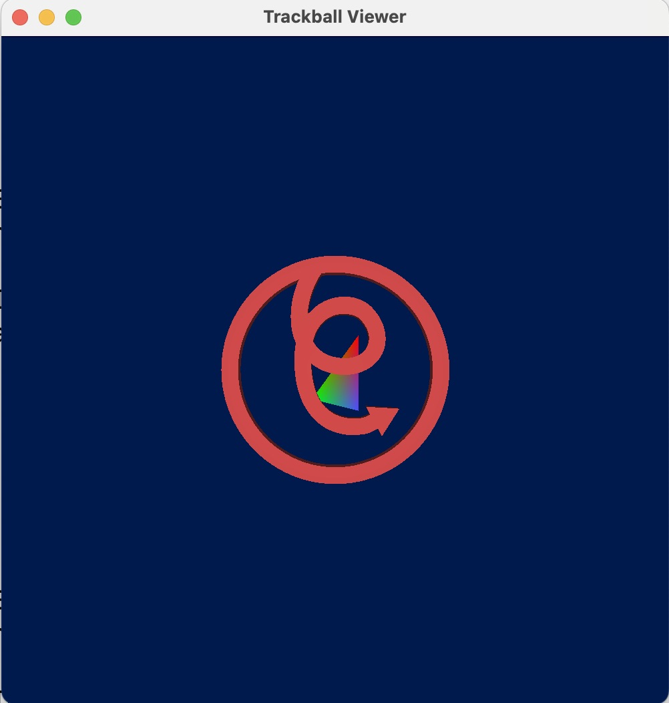

# Trackball Viewer


## Abstract
This TrackballViewer, written by Jehee Lee in 2025, is freeware. You can use, modify, redistribute
the code without restriction. This software requires python3, numpy, and PyGlet to be installed.
I use this code mainly for teaching undergraduate computer graphics courses.

## Run

```python3 viewOBJ.py```

## Usage

**[drag]**: Rotation

**[shift]+[drag]**: Translation

**[control]+[drag]**: Dolly-in/Dolly-out
